# Satellite-Based Disaster Damage Assessment 

An end-to-end deep learning and geospatial analysis project for locating buildings in satellite imagery, predicting post 
disaster damage severity, and using those predictions to assess population and critical-infrastructure exposure.

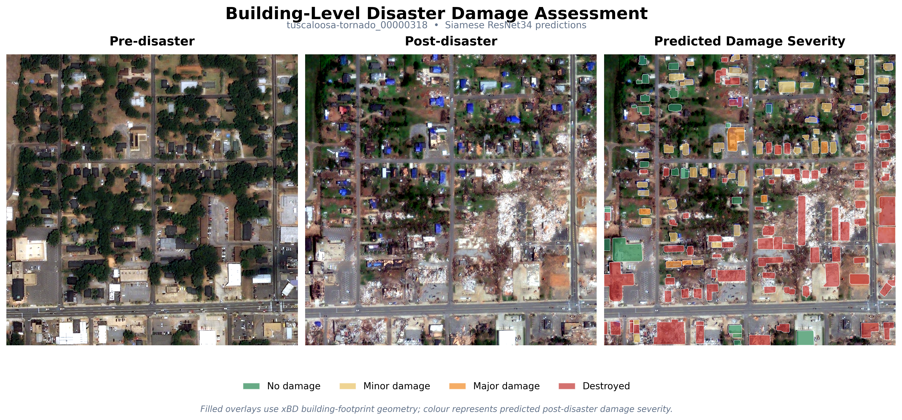

## Project Overview

I built this project to explore how satellite imagery and deep learning could be combined to assess the impact of natural disasters at a large scale. Rather than treating it as a single image-classification problem, I wanted to build a pipeline that starts with raw satellite imagery and ends with information that could actually be useful when assessing an impacted area.

The pipeline first identifies building footprints from satellite imagery using semantic segmentation. Pre and post disaster imagery is then used together to classify each building based on the severity of damage caused. Once the predictions are finished, the system then uses the image metadata to source coordinates and connect all predictions to their respective geographic locations. Finally, I combine the resulting damage maps with external population and infrastructure data to explore the potential human impact of the disaster.

The overall pipeline is:

**Satellite imagery → Building segmentation → Damage classification → Spatial damage mapping → Population & infrastructure exposure**

A major focus of the project was generalisation. To prioritise realistic performance on completely unseen disasters, I made sure to group all images with their respective events during the dataset split so testing data would never resemble training data and lead to falsely inflated results.

## Dataset and Geographic Coverage

The project uses the [xBD/xView2](https://xview2.org/dataset) dataset. The competition dataset provided paired pre and post disaster satellite imagery along with building footprints and damage class labels for each building. In total the dataset provides approximately 425,000 labelled buildings across over 7,000 image pairs, covering earthquakes, flooding, wildfires, tsunamis, volcanic eruptions and wind-related disasters. I chose the dataset for its great diversity, with the multiple classes of disasters, spread across multiple continents, providing a balanced environment which would be required to deploy a model for real world application.

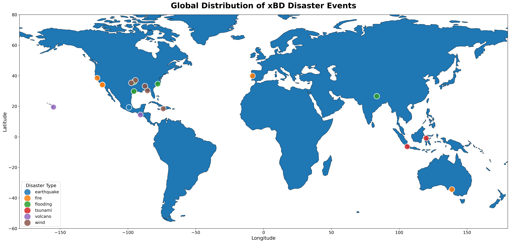

As mentioned before, I separated the data by disaster event rather than randomly splitting images. This allowed the system to be evaluated based on truly unseen disasters as would happen in real life. However this did come with a downside for the less common disasters, such as earthquakes and tsunamis which only appeared once and twice in the dataset respectively, as they were then forced to be absent from one of the split groups, with the tsunami event being in the training and testing data but not the validation.

## Building Footprint Segmentation

The first stage in the pipeline was to identify the buildings themselves. So in order to assess how badly a building had been damaged, I needed a model capable of separating building footprints from the rest of the image.

I chose to compare three semantic-segmentation architectures;
- U-Net
- DeepLabV3+
- U-Net++
I deliberately chose related architectures which used different approaches to feature extraction and reconstruction, as it would allow me to compare both their performance and how information moves through their encoder-decoder structures.

### Architecture Comparison

Despite all three models having the same output goal they reconstruct the spatial information in completely different ways.

- **U-Net** is the most intuitive, essentially compressing an image to later rebuild it. The encoder gradually reduces the detail of the image while learning the features from the most fine such as the edges and then eventually identifying the entire structures and shapes. The decoder then expands the quality of this compressed representation while deciding which pixels belong to target features (our buildings in this case). The features identified in each layer of encoding are passed directly to their corresponding decoder, allowing all features to be identified as the decoder expands back to original quality.

- **U-Net++** follows the same basic idea for its encoding and decoding, but instead of passing the corresponding information directly from each encoder to decoder, it uses a series of intermediate connections to first refine the information. The features are gradually combined with one another at several levels before even reaching the decoder. This extra refinement often helps with the small densely packed buildings which may require combined context to accurately identify.

- **DeepLabV3+** takes a different approach. Rather than relying as strictly on this encoder-decoder structure, it looks at the image on multiple spatial scales, essentially examining each feature on the map through multiple fields of view simultaneously. Combining the outputs from multiple scales of view provides insights about the contextual features which may indicate information on your target (for example when searching for buildings it may identify the road running beside them as a pattern, allowing it to find buildings along roads more easily)

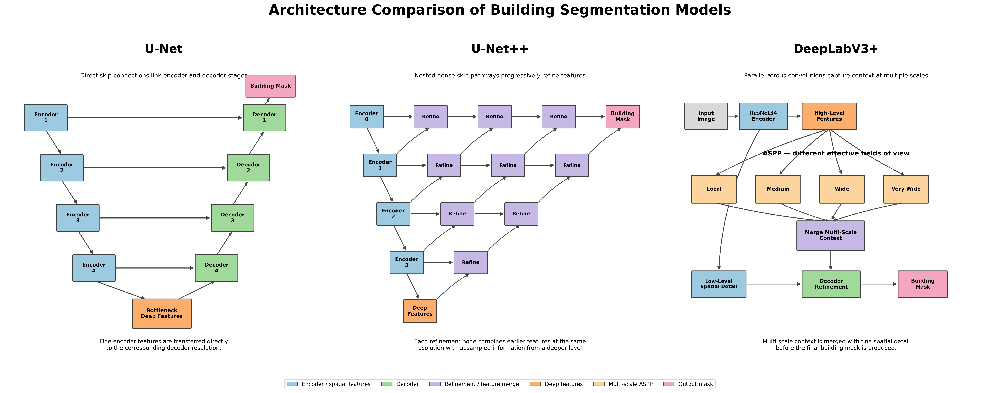

I was particularly interested in the decoder side of the models, as this had to reconstruct the scenes accurately enough to later identify changes in the buildings and recover individual boundaries.

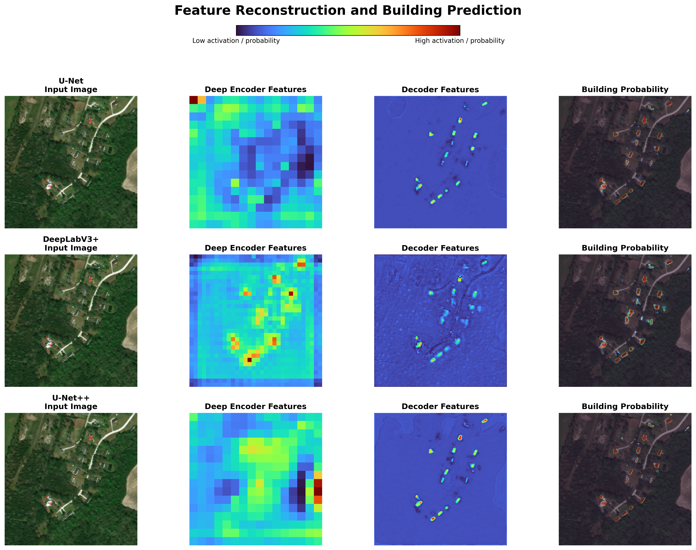

The differences in how each architecture reconstructs the image can also be seen in the intermediate feature maps. U-Net's encoder representation is very coarse, but its decoder becomes sharply focused around individual buildings, reflecting its direct skip connections that return fine spatial detail from earlier layers. DeepLabV3+ retains much more visible texture across the scene in its decoder, including responses around roads and surrounding terrain, which is consistent with its use of multi-scale context to understand features alongside their wider surroundings. U-Net++ produces a cleaner, more localised decoder map similar to U-Net, but the building responses are progressively refined, reflecting its nested skip connections that combine encoder and decoder information through several intermediate stages. Despite these differences, the final outputs are virtually identical.

### From Features to Building Masks

To get a better idea of what was happening inside the segmentation models, I also visualised intermediate feature representations rather than treating each network entirely as a black box.

The example below follows the U-Net++ decoder as it progressively reconstructs a building mask. Early decoder features still respond broadly to the structure of the scene, while later stages become increasingly concentrated around individual buildings. The final output converts these reconstructed features into a pixel-level building probability map.

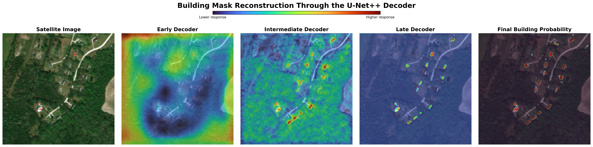

This shows how a model is not simply identifying a building once at the end of the network, but rather reconstructing the building mask back up from largest features to most detailed.

### Segmentation Results

IoU (Intersection over Union), which measures the overlap between the predicted and ground-truth building masks, was my primary measure of segmentation performance. After training each model for a baseline of 20 epochs, the U-Net++ showed the most promise, leading me to give it a full 50 epochs of training. The U-Net++ then achieved the highest score of 0.650, comparing to 0.628 and 0.589 for the U-Net and DeepLabV3+ respectively.

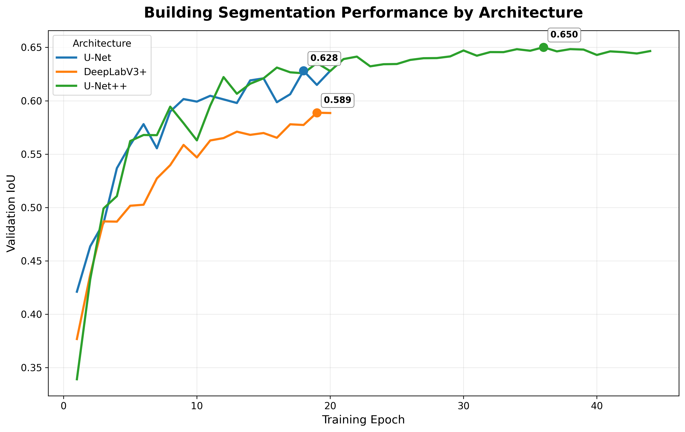

This metric supported the use of the U-Net++ model for the next stage of the project. However I wanted to look beyond a single aggregate metric, so I compared the models' performance on a difficult scene containing a dense cluster of buildings.

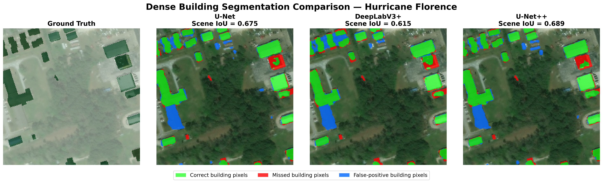

The models generally recover the larger buildings well, with smaller buildings and exact boundaries proving much more difficult.

## Building Damage Classification

Now that I had a model for successfully identifying buildings, I had to determine how severely each building was damaged. This stage is much harder than simply identifying the buildings as the differences between damage classes can be quite subtle from above, especially when trying to separate minor and major damage.

I figured the best way to do this would be to simultaneously look at both pre and post disaster image crops. This helps identify any subtle changes by referencing the pre disaster appearance. Each building was then classified into one of four categories, being no damage, minor damage, major damage and destroyed.

### Siamese Architecture

I chose to use a Siamese ResNet architecture. The main idea is to pass both pre and post disaster images through the same type of feature extractor, producing compact representations of each image, these are then combined before the final classifier predicts the damage class. Essentially the model is trained to answer "How much did this footprint change?", with the answer being checked against its learned pattern to see what damage class it aligns with.

I started with the ResNet18 as a lightweight baseline before testing the deeper ResNet34. I also experimented with giving the ResNet34 more surrounding context and focal loss oversampling to see whether its interpretations of the less common damage classes could be improved.

### Model Experiments

I compared the models using macro F1 rather than relying mainly on accuracy. The dataset contains far more no-damage buildings than some of the damaged classes, so a model could achieve a fairly strong accuracy while still performing badly on the classes I was most interested in detecting. Macro F1 gives each of the four damage classes equal importance when calculating the overall score.

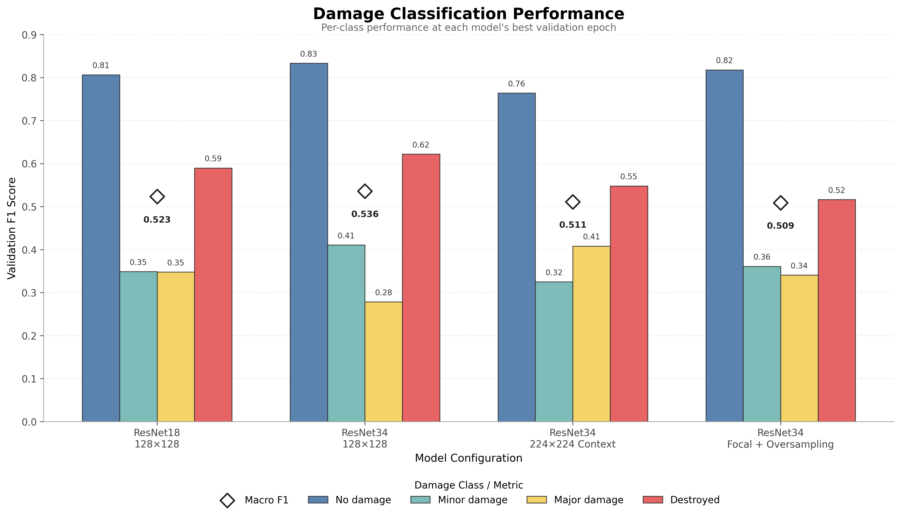

The best result came from the base Siamese ResNet34 model, which achieved a validation macro F1 of approximately 0.536. Interestingly, the additional experiments did not produce a clear improvement, the larger-context ResNet34 reached around 0.511, while the focal loss/oversampling model reached around 0.509. ResNet18 also remained very competitive at approximately 0.535.

I found this quite interesting as adding more model complexity or more aggressive class-balancing techniques did not actually yield better results on the unseen data. The small difference between the ResNet18 and ResNet34 also suggested that model capacity alone was not the main limitation of the classification task.

### Training Behaviour

Looking at the ResNet34 training history also revealed a fairly clear gap between training and validation performance. Training macro F1 continued to improve while validation performance began to level off, suggesting that the model was increasingly fitting patterns specific to the training disasters rather than improving its ability to generalise to unseen events.

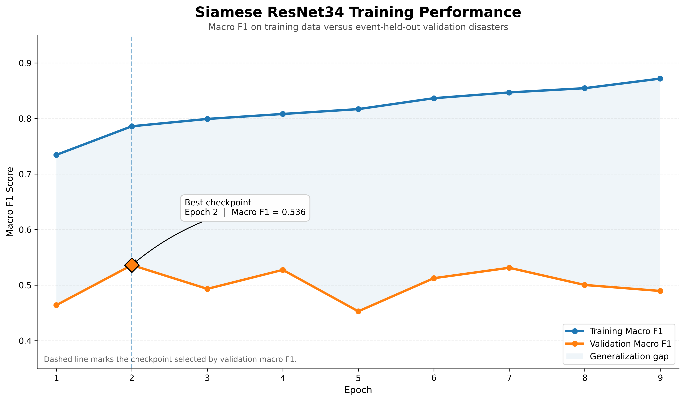

Because of this overfitting, I used the checkpoint with the strongest validation performance rather than simply taking the model from the final training epoch. This discrepancy between training and validation shows how difficult it is to teach a model to perform on completely unseen events.

### Class Level Performance

A confusion matrix is a great way to communicate exactly where the model struggled.

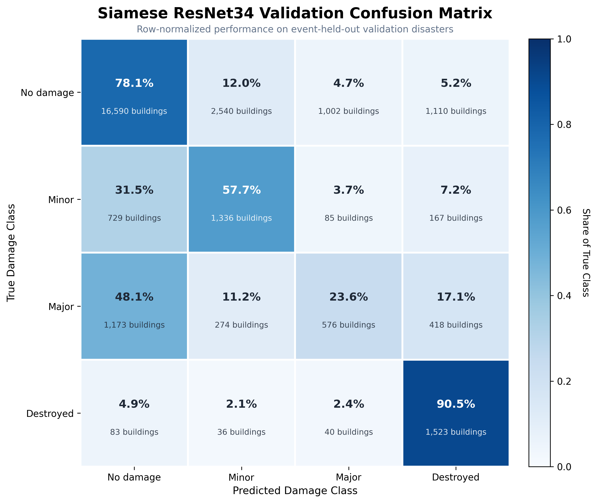

The extreme ends of the damage scale were quite easy to identify, no damage and destroyed either display no change or a completely new mask from pre to post disaster imagery. However the differences between the minor and major damage can often depend on relatively small visual changes, this is also made even harder by the presence of clouds or fog which can easily confuse the classifier model.

This was by far the biggest limitation of the damage-classification stage and was not fully communicated by the overall macro F1 score alone.

### Prediction Confidence and Failure Analysis

Finally, I created a display of examples which showed the model's performances with various levels of confidence throughout each of the classes. This allowed me to investigate why the model was making mistakes, rather than treating every incorrect prediction as equivalent.

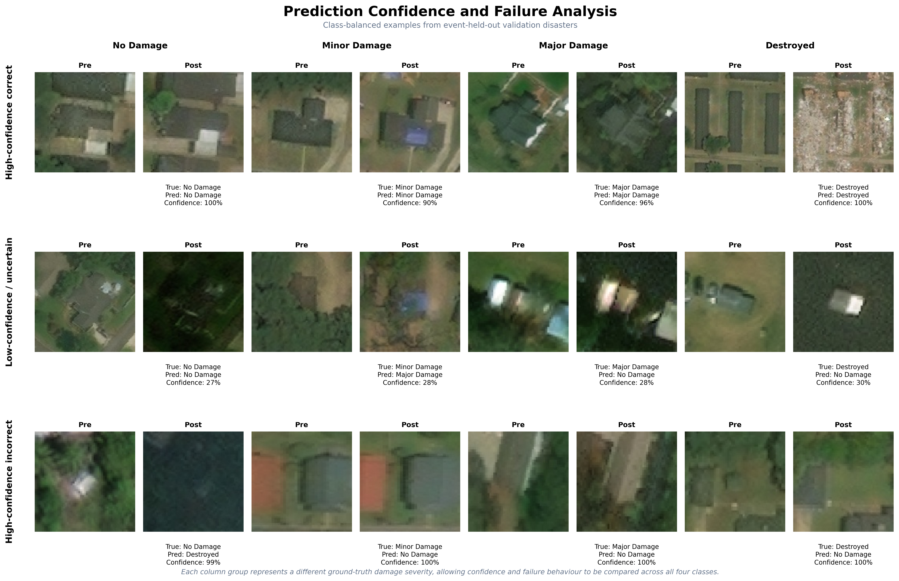

Some mistakes occur on buildings where the distinction between neighbouring damage classes is genuinely difficult to see from the available imagery. More concerning are high-confidence mistakes, where the model has found a visual pattern that strongly supports the wrong class. Looking at these cases helped identify where the classifier was still unreliable and reinforced why confidence scores should not be interpreted as a guarantee that a prediction is correct.

### Model Summary

| Stage | Model | Validation Metric | Result |
|---|---|---|---:|
| Building Segmentation | U-Net | IoU | 0.628 |
| Building Segmentation | DeepLabV3+ | IoU | 0.589 |
| **Building Segmentation** | **U-Net++** | **IoU** | **0.650** |
| Damage Classification | Siamese ResNet18 | Macro F1 | 0.535 |
| **Damage Classification** | **Siamese ResNet34** | **Macro F1** | **0.536** |
| Damage Classification | ResNet34 + Context | Macro F1 | 0.511 |
| Damage Classification | ResNet34 + Focal/Oversampling | Macro F1 | 0.509 |

## From Building Predictions to Disaster Maps

Once I had the building level damage predictions, I wanted to move beyond evaluating buildings individually and see whether the model could reproduce the wider spatial pattern of a real disaster. Using the xBD metadata annotations provided, each prediction could be mapped back to the real location of the area it represents.

I used the Tuscaloosa tornado for the main analysis as this validation set contains over 14,000 buildings, giving enough predictions to examine damage patterns across a much larger area than one satellite scene.

### Ground Truth vs Predicted Damage

The first step was to compare the geographic distribution of the model's predictions directly with the xBD ground truth damage labels.

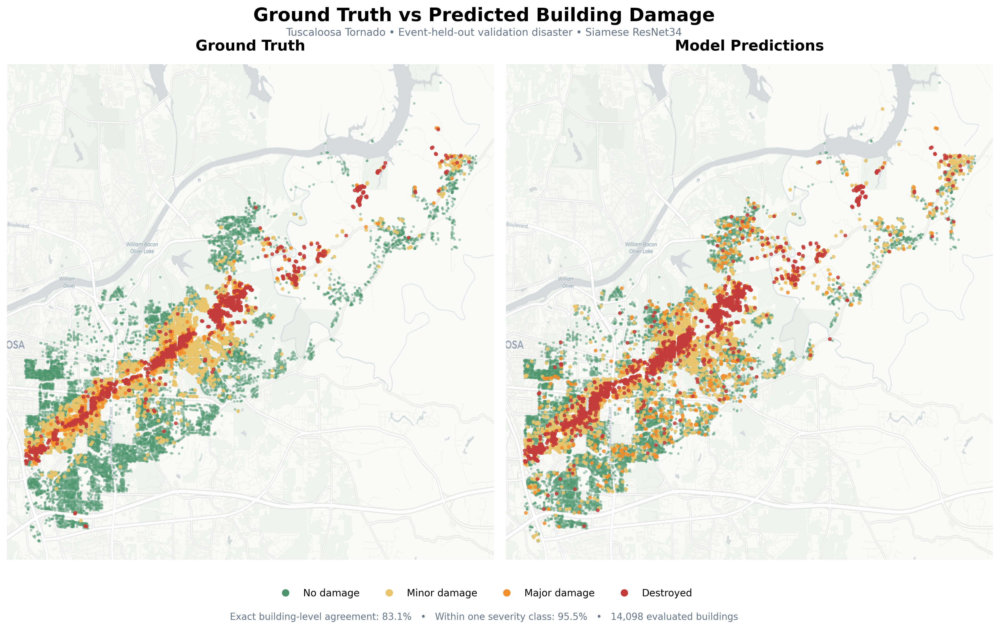

Across the Tuscaloosa case study, 83.1% of buildings received the exact correct damage class, while 95.5% were predicted within one severity level of the ground truth. I found the second result particularly useful because the damage classes are ordered: predicting a destroyed building as major damage is still an error, but it is quite different from predicting that same building as undamaged.

More importantly, mapping the predictions made it possible to see whether the model preserved the overall geographic structure of the disaster. The predicted map reproduces much of the concentrated damage corridor visible in the ground truth, even though individual building-level errors remain.

## Population Exposure Analysis

Mapping severity of building damage was useful for evaluating the model, however it is important to use those results in a way which communicates the level of impact on human life. To extend the project beyond identifying where structural damage occurred I integrated WorldPop population estimates with the 500m damage grids, this allowed each area to contain information about the predicted severity of building damage and the estimated population living within it.

### Population Impact Mapping

I combined these two pieces of information into a simplified "population impact priority score", which gives higher priority to areas with both high population density and high damage severity. This was not an estimate of casualties or people affected, but a way of highlighting areas where structural damage overlaps with greater potential population exposure.

To see if the  model's classification errors had a substantial effect on this downstream analysis, I found the impact scores twice, using both ground truth and the model's predictions.

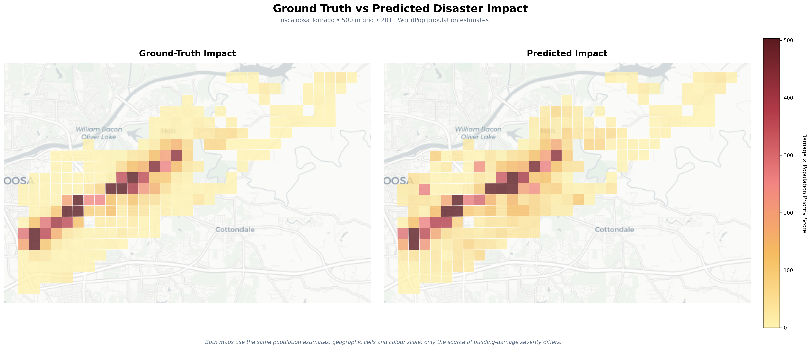

I found this quite helpful, as despite the building level classification errors, this shows the model can still answer practical questions by showing which areas were impacted the most.

## Critical Infrastructure Exposure

For the final stage of analysis, I wanted to explore the model's predictions in relation to the location of critical infrastructure.

This time I used Hurricane Florence for the analysis, combining its predicted damage grid with road and facility data taken from OpenStreetMap. This included infrastructure such as hospitals, fire stations, police stations and schools.

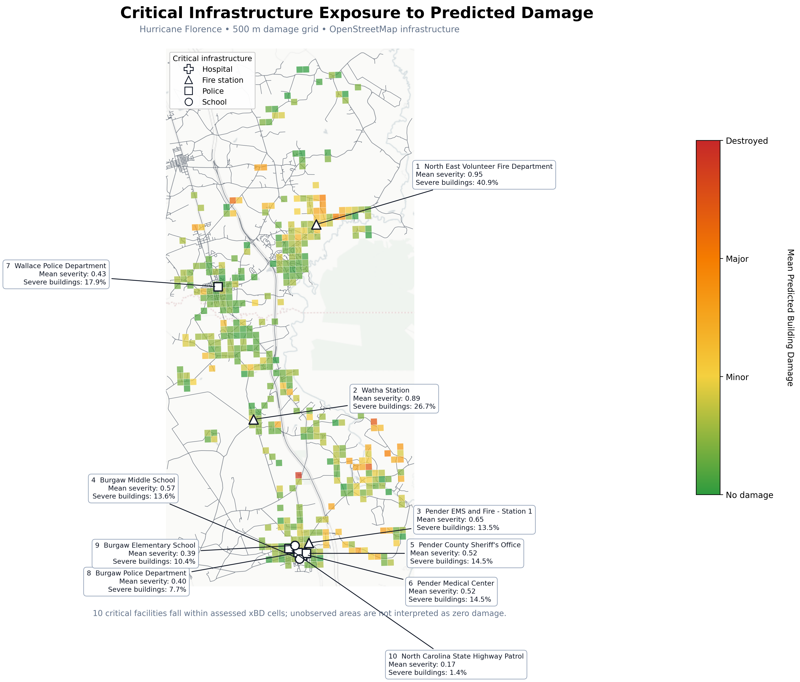

This map helps to identify critical infrastructure located in areas of severe damage, allowing prioritisation within the post disaster action plan. 

## Limitations and Future Improvements

The biggest limitation I found was the model's ability to differentiate between the intermediate damage classes. Minor and major damage can look very similar from overhead satellite imagery, particularly when only small structural changes are visible. Differences in image quality, viewing angle, cloud cover and alignment between the pre and post disaster images can make this even harder.

Generalisation was another major challenge. I deliberately kept entire disaster events together during the dataset split so that the models would be evaluated on genuinely unseen events. While I think this gives a more realistic measure of performance, it also meant that some of the less common disaster types could be missing entirely from individual training, validation or test sets.

The project was also somewhat limited by the compute and storage available to me through Google Colab. This often influenced training decisions, as it was quite hard to deal with such a large amount of high quality imagery. With access to more compute, I would like to try training at higher resolutions and explore more architectures designed specifically for detecting changes across image pairs.

Aside from the limitations, if I continued to develop the project, I would also expand the geospatial side of the pipeline. The WorldPop and OpenStreetMap integrations demonstrate how building predictions can be turned into wider impact information, but additional data such as road accessibility, emergency-service capacity and measures of population vulnerability could make the final assessment considerably more useful.

## Notes

### Tools and Technologies

- Deep Learning: PyTorch, segmentation-models-pytorch, ResNet, U-Net, U-Net++, DeepLabV3+
- Data Processing: Python, Pandas, NumPy
- Computer Vision: OpenCV, Rasterio
- Geospatial Analysis: GeoPandas, Shapely, Contextily
- External Data: xBD/xView2, WorldPop, OpenStreetMap
- Development & Compute: Jupyter/Google Colab, NVIDIA GPU acceleration

### Reproducing the Project

- The complete workflow is contained in satellite_disaster_damage.ipynb.
- The notebook covers data preprocessing, building segmentation, damage classification, model evaluation and geospatial analysis.
- The original xBD/xView2 dataset must be downloaded separately due to its size.
- Processed imagery and trained model weights are not included in the repository due to their storage requirements.
- The models were trained using Google Colab with GPU acceleration.
- A GPU is strongly recommended for reproducing model training, although much of the preprocessing, evaluation and geospatial analysis can be run on CPU.

### Data Sources

- xBD/xView2, pre and post disaster satellite imagery, building footprints and damage labels.
- WorldPop, population estimates used for population-exposure analysis.
- OpenStreetMap, road and critical infrastructure data used for infrastructure-exposure analysis.

### License

- Released under the MIT License.
- Full terms available in the repository's LICENSE file.

